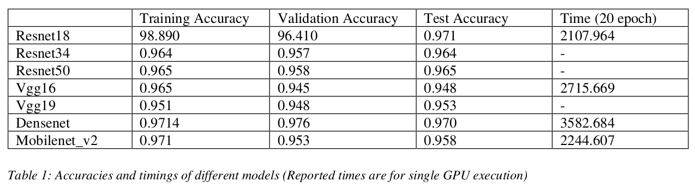

## Datasets That I Used
* Cabani, Adnane, et al. “MaskedFace-Net -- A Dataset of Correctly/Incorrectly Masked Face Images in the Context of COVID-19.” Smart Health, vol. 19, Mar. 2021, p. 100144. arXiv.org, doi:10.1016/j.smhl.2020.100144.

* "Face Mask Detection". kaggle.com. https://www.kaggle.com/andrewmvd/face-mask-detection,
2021

## Accuracy and Train Time

If you have more than one GPU, train.py automatically runs it in parallel but the training times reported below is for single NVIDIA V100 GPU.



## Installation

```
pip install -r requirements.txt
```

Creating a virtual environment is recommended. Images are expected to be under "train" folder. Expected structure:

```
train/
    0/
    1/ 
    2/
```

## Usage

To train:

```
python train.py
```

To test video (if you want to test on your laptop's camera, give video_path as 0):

```
python test.py --video=<video_path> --model-path=<path_to_the_model>
```

To test an image:

```
python test.py --image=<image_path> --model-path=<path_to_the_model>
```